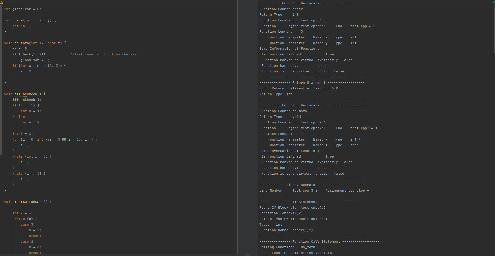

# Characterization Tool for C/C++ codes
A static analysis Clang based tool which characterizes C/C++ code by doing an Abstract Syntax Tree traversal. 
The tool counts and lists the following statements:
- Labeled 
- Compound
- Selection/Conditional
- Iteration
- Jump. 
  
This tool can be used to find types of statements in a code and for understand coding style of a programmer or a package.
This tool is ROS-compatible.

### Compile Command:
```bash
clang++ Analyse_Programs.cpp -fno-rtti -lpthread -lm -lLLVMX86Disassembler \
-lLLVMX86AsmParser -lLLVMX86CodeGen -lLLVMSelectionDAG -lLLVMAsmPrinter \
-lLLVMMCParser -lLLVMCodeGen -lLLVMScalarOpts -lLLVMInstCombine\
-lLLVMTransformUtils -lLLVMipa -lLLVMAnalysis -lLLVMTarget -lLLVMCore \
-lLLVMX86AsmPrinter -lLLVMMC -lLLVMX86Info -lLLVMSupport -lclangFrontendTool \
-lclangFrontend -lclangDriver -lclangSerialization -lclangCodeGen -lclangParse \
-lclangSema -lclangStaticAnalyzerFrontend -lclangStaticAnalyzerCheckers \
-lclangStaticAnalyzerCore -lclangAnalysis -lclangARCMigrate -lclangRewriteCore \
-lclangEdit -lclangIndex -lclangAST -lclangLex -lclangBasic -lclangTooling \
-lclangASTMatchers -lclangLex -I/opt/llvm/tools/clang/include/ `llvm-config \
--cxxflags --ldflags --libs all` -D__STDC_CONSTANT_MACROS -D__STDC_LIMIT_MACROS \
-std=c++0x
```

## Sample Output:
